# Explore and Summarize Data
José Alves-Rausch  
22nd February 2016  

# Introduction

This project aims at use R and exploratory data analysis techniques to explore a public available dataset about Wine Quality. The paper covering the dataset is available at [Elsevier](http://dx.doi.org/10.1016/j.dss.2009.05.016) and a short description of the available variables and their meanings is found on this [description file](data_set_description.txt).

The dataset contains several physicochemical attributes from red variants of the Portuguese "Vinho Verde" wine and sensory classification made by wine experts.


# Data analysis and exploration


# Univariate Plots Section

First things first. Lets have a glimpse at the data.


```
## Observations: 1,599
## Variables: 12
## $ fixed.acidity        (dbl) 7.4, 7.8, 7.8, 11.2, 7.4, 7.4, 7.9, 7.3, ...
## $ volatile.acidity     (dbl) 0.700, 0.880, 0.760, 0.280, 0.700, 0.660,...
## $ citric.acid          (dbl) 0.00, 0.00, 0.04, 0.56, 0.00, 0.00, 0.06,...
## $ residual.sugar       (dbl) 1.9, 2.6, 2.3, 1.9, 1.9, 1.8, 1.6, 1.2, 2...
## $ chlorides            (dbl) 0.076, 0.098, 0.092, 0.075, 0.076, 0.075,...
## $ free.sulfur.dioxide  (dbl) 11, 25, 15, 17, 11, 13, 15, 15, 9, 17, 15...
## $ total.sulfur.dioxide (dbl) 34, 67, 54, 60, 34, 40, 59, 21, 18, 102, ...
## $ density              (dbl) 0.9978, 0.9968, 0.9970, 0.9980, 0.9978, 0...
## $ pH                   (dbl) 3.51, 3.20, 3.26, 3.16, 3.51, 3.51, 3.30,...
## $ sulphates            (dbl) 0.56, 0.68, 0.65, 0.58, 0.56, 0.56, 0.46,...
## $ alcohol              (dbl) 9.4, 9.8, 9.8, 9.8, 9.4, 9.4, 9.4, 10.0, ...
## $ quality              (fctr) 5, 5, 5, 6, 5, 5, 5, 7, 7, 5, 5, 5, 5, 5...
```

There are  12 variables and 1599 observations. All variables are numerical except for the quality score which is represented as a ordered factor.

## Quality


```
##   3   4   5   6   7   8 
##  10  53 681 638 199  18
```

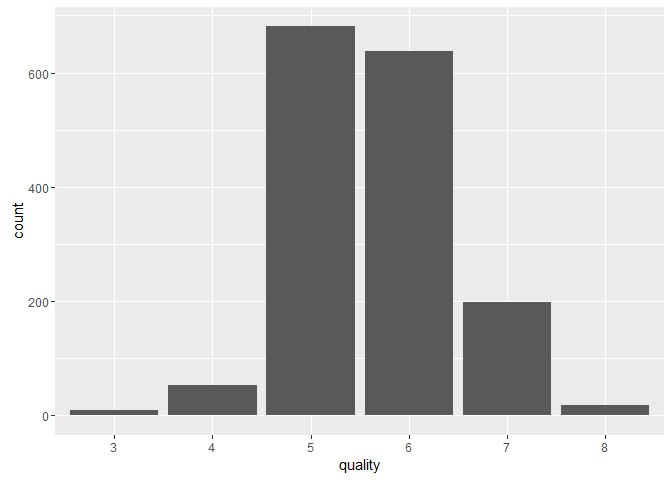<!-- -->

We can say the distribution of quality appears to be normal with many wines at average quality (4-5) and fewer wines at low quality and high quality. There are no wines with a quality worse than 3 and no wines with quality higher than 8.

## Fixed Acidity


```
##    Min. 1st Qu.  Median    Mean 3rd Qu.    Max. 
##    4.60    7.10    7.90    8.32    9.20   15.90
```

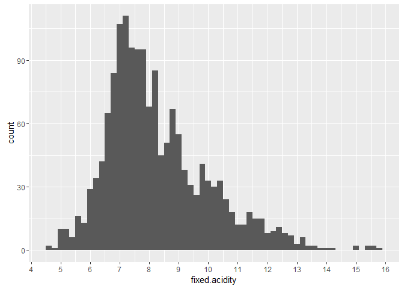<!-- -->

The median fixed acidity in the wines present in the dataset is 7.90 $g/dm^3$. Most wines have an acidity between 7.10 and 9.20. The distribution of fixed acidity is slightly right skewed. There are some outliers in the higher range (~ >15)

## Volatile acidity


```
##    Min. 1st Qu.  Median    Mean 3rd Qu.    Max. 
##  0.1200  0.3900  0.5200  0.5278  0.6400  1.5800
```

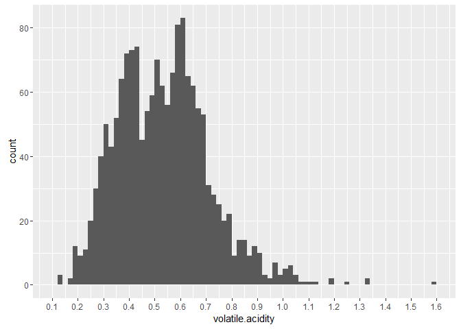<!-- -->

The distribution of volatile acidity is non-symmetric and bimodal with two peaks at 0.4 and 0.6. The median value is 0.52. Most observations fall in the range 0.39 - 0.64 and outliers on the higher end of the scale are visible.

## Citric acid


```
##    Min. 1st Qu.  Median    Mean 3rd Qu.    Max. 
##   0.000   0.090   0.260   0.271   0.420   1.000
```

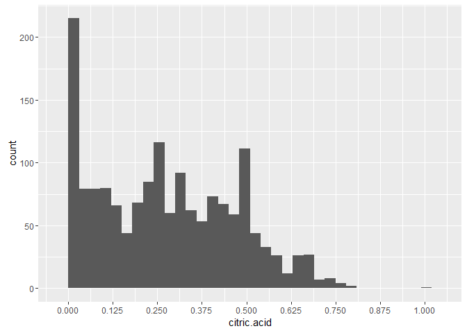<!-- -->

Most wines have 0 $g/dm^3$ of citric acid. This acid is always found in very small quantities. The distribution is right skewed with some ups and downs. We can see peaks at 0.250 and 0.500 which may hint at some bimodal behavior. A single wine appears far away on the right side with 1 $g/dm^3$ of citric acid.

## Residual sugar


```
##    Min. 1st Qu.  Median    Mean 3rd Qu.    Max. 
##   0.900   1.900   2.200   2.539   2.600  15.500
```

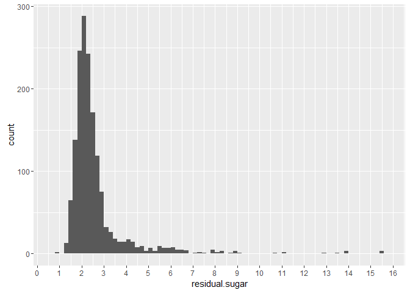<!-- -->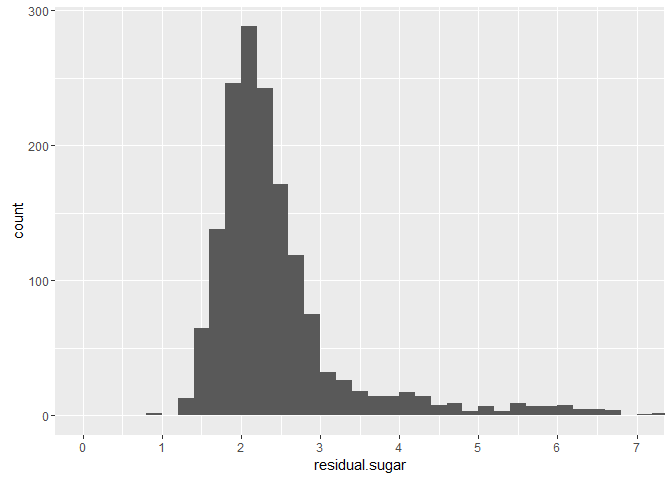<!-- -->

The distribution of residual sugar has a median value of 2.2 $g/dm^3$. The distribution is right skewed with a long tail in the right side. There are many small bars on the right side of the main peak.

## Chlorides


```
##    Min. 1st Qu.  Median    Mean 3rd Qu.    Max. 
## 0.01200 0.07000 0.07900 0.08747 0.09000 0.61100
```

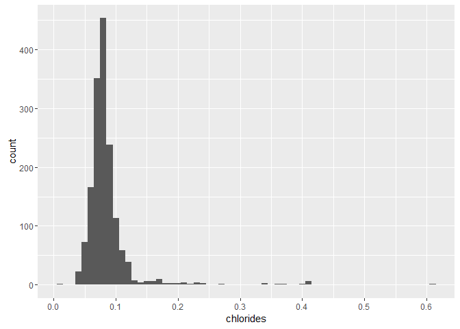<!-- -->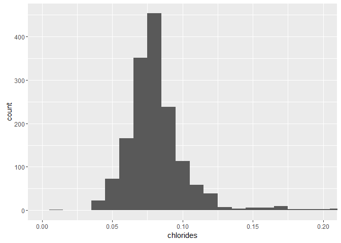<!-- -->

The amount of chlorides in the wines has a median value of 0.079 $g/dm^3$. The distribution with looks normal around its main peak but has a very long right tail, with small counts of wines with values until 0.611 $g/dm^3$

## Free sulfur dioxide


```
##    Min. 1st Qu.  Median    Mean 3rd Qu.    Max. 
##    1.00    7.00   14.00   15.87   21.00   72.00
```

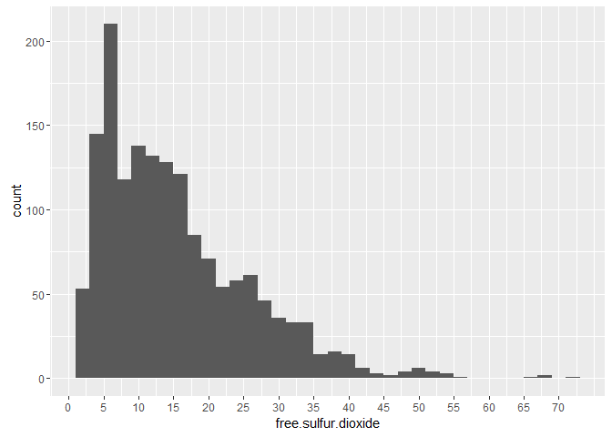<!-- -->

The distribution of free sulfur dioxide concentrations is right skewed. The median value is 14 $mg/dm^3$. The right tail extends until a maximum of 72 with a gap between 57 and 66.

## Total sulfur dioxide


```
##    Min. 1st Qu.  Median    Mean 3rd Qu.    Max. 
##    6.00   22.00   38.00   46.47   62.00  289.00
```

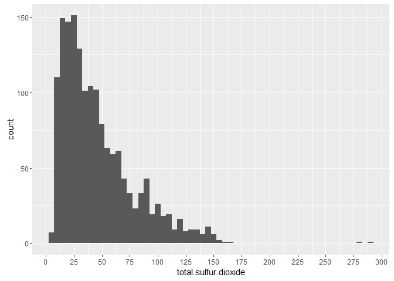<!-- -->

The distribution of total sulfur dioxide is right skewed with a median value of 38 $mg/dm^3$. On the right tail we can see a local maximum near 80. There's a gap between 165 and 278 with only two wines with a concentration greater than or equal to 278.

## Density


```
##    Min. 1st Qu.  Median    Mean 3rd Qu.    Max. 
##  0.9901  0.9956  0.9968  0.9967  0.9978  1.0040
```

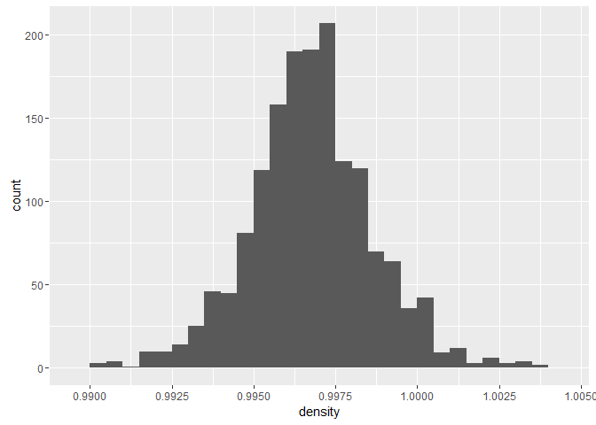<!-- -->

The density of wines varies few, with most of the values between 0.9956 and 0.9967. The distribution is almost symmetric and has median value of 0.9968 $g/cm^3$. The density if close to the density of water (1 $g/cm^3$ at 4 $^\circ C$).

## pH


```
##    Min. 1st Qu.  Median    Mean 3rd Qu.    Max. 
##   2.740   3.210   3.310   3.311   3.400   4.010
```

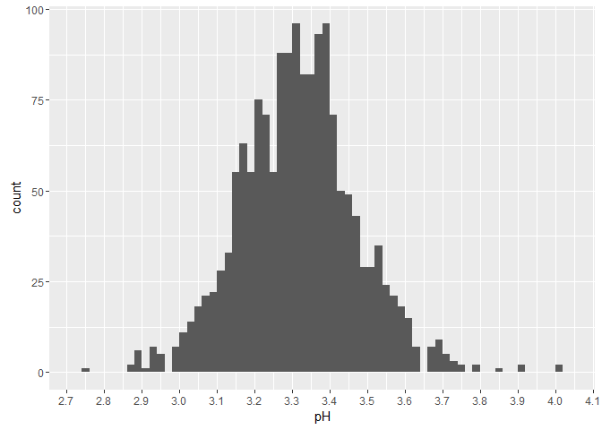<!-- -->

All wines have low pH. This makes sense since trough the fermentation process, acids are produced. The distribution seems symmetrical or could be also considered bimodal with both peaks very close to each other. There seems to be a local maximum at around 3.2 and then another one at 3.35.  The median value is 3.31, and most wines have a pH between 3.21 and 3.4.

## Sulphates


```
##    Min. 1st Qu.  Median    Mean 3rd Qu.    Max. 
##  0.3300  0.5500  0.6200  0.6581  0.7300  2.0000
```

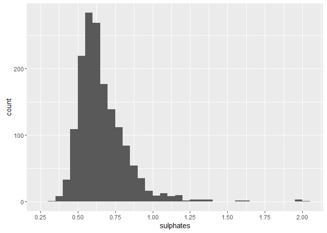<!-- -->

The distribution of sulphates is slightly right skewed. Some outliers on the right tail have around 2 g/dm^3 of sulphates.
The median value of sulphates is 0.62 and most wines have a concentration between 0.55 and 0.73.

## Alcohol


```
##    Min. 1st Qu.  Median    Mean 3rd Qu.    Max. 
##    8.40    9.50   10.20   10.42   11.10   14.90
```

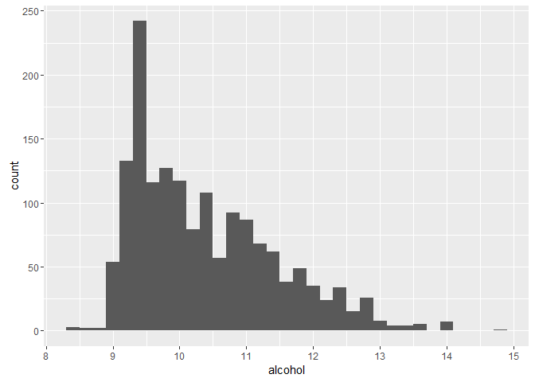<!-- -->

The alcohol concentration distribution is right skewed. There seems to be a natural border on the left side. Maybe a minimum amount of alcohol needs to be present for the drink to be considered a wine? The highest peak of the distribution is at 9.5 % alcohol and the median value is 10.20%. The maximum amount of alcohol present in the dataset is 14.90.


# Univariate Analysis

### What is the structure of your dataset?

The dataset has 12 variables regarding 1599 observations. Each observation corresponds to a red wine sample. 11 variables correspond to the result of a physicochemical test and one variable (`quality`) corresponds to the result of a sensory panel rating.


### What is/are the main feature(s) of interest in your dataset?

The main feature of interest is the quality rating.


### What other features in the dataset do you think will help support your investigation into your feature(s) of interest?

I think all the physicochemical test results may help support the investigation. All of them are related to characteristics which may affect the flavor of the wine. They correspond to concentration of molecules which may have an impact on taste. Density is a physical property which will depend on the percentage of alcohol and sugar content, which will also affect taste.

Some variables may have strong correlation with each other. For instance, the pH will depend on the amount of acid molecules, while total sulfur dioxide may always follow a similar distribution of free sulfur dioxide.

### Did you create any new variables from existing variables in the dataset?

No new variables were created in the dataset.

### Of the features you investigated, were there any unusual distributions? Did you perform any operations on the data to tidy, adjust, or change the form of the data? If so, why did you do this?

There were no unusual distributions, no missing values and no need to adjust the data. The dataset presented is already tidy which makes it an ideal dataset for a learning project as this one.

# Bivariate Plots Section


## Fixed Acidity vs. Quality


```
## [1] "Median of fixed.acidity by quality:"
## wines$quality: 3
## [1] 7.5
## -------------------------------------------------------- 
## wines$quality: 4
## [1] 7.5
## -------------------------------------------------------- 
## wines$quality: 5
## [1] 7.8
## -------------------------------------------------------- 
## wines$quality: 6
## [1] 7.9
## -------------------------------------------------------- 
## wines$quality: 7
## [1] 8.8
## -------------------------------------------------------- 
## wines$quality: 8
## [1] 8.25
```

<!-- -->

We see a very slight upwards trend of higher quality with higher fixed acidity. However, the extreme quality classes (3 and 8) have less observations than the middle ones, which may make the median value not so accurate. And we see a drop of acidity from 7 to the 8 quality class. Additionally, we see a big dispersion of acidity values across each quality scale. This may be a indicator that the quality cannot be predicted based only on the value of acidity and is the result of a combination of more variables.

## Volatile Acidity vs. Quality


```
## [1] "Median of volatile.acidity by quality:"
## wines$quality: 3
## [1] 0.845
## -------------------------------------------------------- 
## wines$quality: 4
## [1] 0.67
## -------------------------------------------------------- 
## wines$quality: 5
## [1] 0.58
## -------------------------------------------------------- 
## wines$quality: 6
## [1] 0.49
## -------------------------------------------------------- 
## wines$quality: 7
## [1] 0.37
## -------------------------------------------------------- 
## wines$quality: 8
## [1] 0.37
```

<!-- -->

Having in mind the same limitations as referred for the Fixed Acidity (extreme classes with less observations and variability inside the same quality class), we can see a more obvious trend. Lower volatile acidity seems to mean higher wine quality.

## Citric Acid vs. Quality


```
## [1] "Median of citric.acid by quality:"
## wines$quality: 3
## [1] 0.035
## -------------------------------------------------------- 
## wines$quality: 4
## [1] 0.09
## -------------------------------------------------------- 
## wines$quality: 5
## [1] 0.23
## -------------------------------------------------------- 
## wines$quality: 6
## [1] 0.26
## -------------------------------------------------------- 
## wines$quality: 7
## [1] 0.4
## -------------------------------------------------------- 
## wines$quality: 8
## [1] 0.42
```

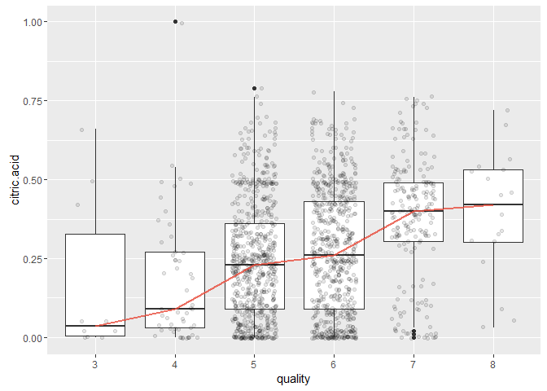<!-- -->

Higher citric acid seems to mean a higher quality wine. The citric acid is always in low concentrations and in the univariate plots we saw that the distribution peaked at the zero value.

Let's see which proportion of wines has zero citric acid. For all the wines that proportion is:


```
## [1] 0.08255159
```

For each quality class the proportions are:


```
## Source: local data frame [6 x 2]
## 
##   quality     n_zero
##    (fctr)      (dbl)
## 1       3 0.30000000
## 2       4 0.18867925
## 3       5 0.08370044
## 4       6 0.08463950
## 5       7 0.04020101
## 6       8 0.00000000
```

We see a decreasing proportion of wines with zero citric acid on the higher quality classes.

So, this reinforces the first impression that the higher citric acid concentration relates to higher quality wines.

## Residual Sugar vs. Quality


```
## [1] "Median of residual.sugar by quality:"
## wines$quality: 3
## [1] 2.1
## -------------------------------------------------------- 
## wines$quality: 4
## [1] 2.1
## -------------------------------------------------------- 
## wines$quality: 5
## [1] 2.2
## -------------------------------------------------------- 
## wines$quality: 6
## [1] 2.2
## -------------------------------------------------------- 
## wines$quality: 7
## [1] 2.3
## -------------------------------------------------------- 
## wines$quality: 8
## [1] 2.1
```

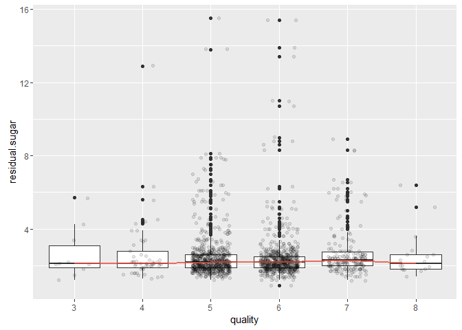<!-- -->

```
## [1] "Median of residual.sugar by quality:"
## wines$quality: 3
## [1] 2.1
## -------------------------------------------------------- 
## wines$quality: 4
## [1] 2.1
## -------------------------------------------------------- 
## wines$quality: 5
## [1] 2.2
## -------------------------------------------------------- 
## wines$quality: 6
## [1] 2.2
## -------------------------------------------------------- 
## wines$quality: 7
## [1] 2.3
## -------------------------------------------------------- 
## wines$quality: 8
## [1] 2.1
```

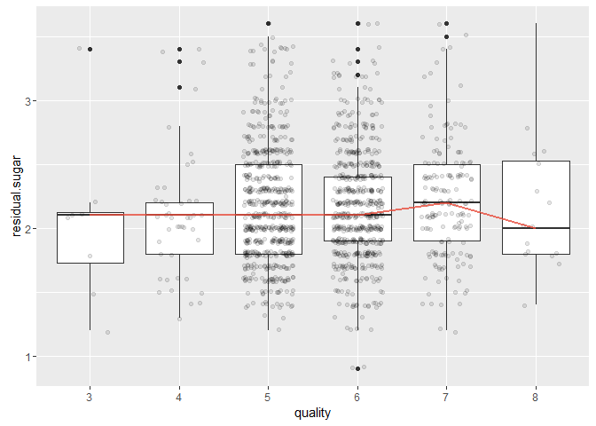<!-- -->

Residual sugar seems to have a low impact in the quality of the wine.

## Chlorides vs. Quality


```
## [1] "Median of chlorides by quality:"
## wines$quality: 3
## [1] 0.0905
## -------------------------------------------------------- 
## wines$quality: 4
## [1] 0.08
## -------------------------------------------------------- 
## wines$quality: 5
## [1] 0.081
## -------------------------------------------------------- 
## wines$quality: 6
## [1] 0.078
## -------------------------------------------------------- 
## wines$quality: 7
## [1] 0.073
## -------------------------------------------------------- 
## wines$quality: 8
## [1] 0.0705
```

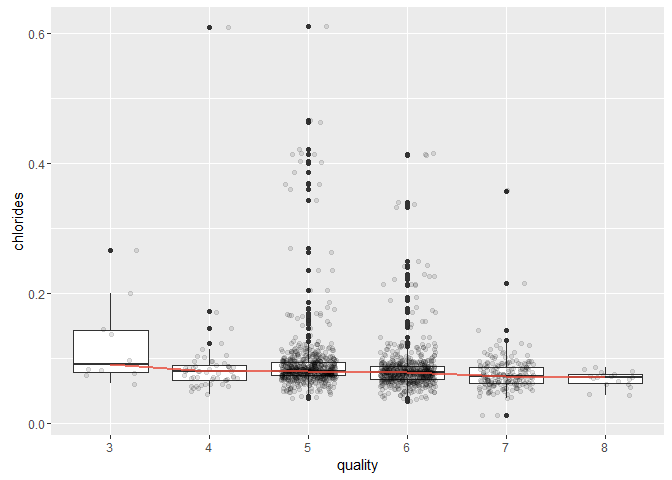<!-- -->

```
## [1] "Median of chlorides by quality:"
## wines$quality: 3
## [1] 0.0905
## -------------------------------------------------------- 
## wines$quality: 4
## [1] 0.08
## -------------------------------------------------------- 
## wines$quality: 5
## [1] 0.081
## -------------------------------------------------------- 
## wines$quality: 6
## [1] 0.078
## -------------------------------------------------------- 
## wines$quality: 7
## [1] 0.073
## -------------------------------------------------------- 
## wines$quality: 8
## [1] 0.0705
```

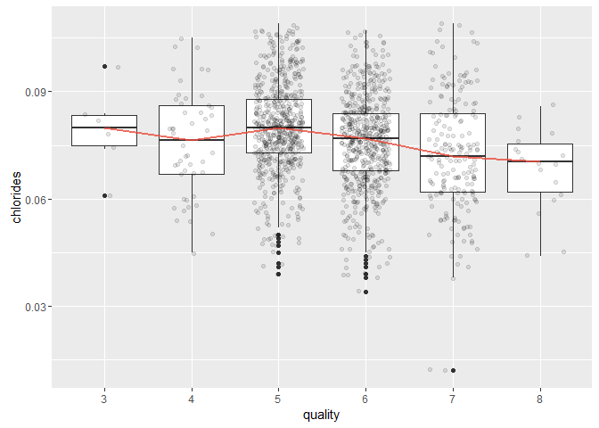<!-- -->

A slight relation. Less chlorides means higher quality.

## Free sulfur dioxide vs. Quality


```
## [1] "Median of free.sulfur.dioxide by quality:"
## wines$quality: 3
## [1] 6
## -------------------------------------------------------- 
## wines$quality: 4
## [1] 11
## -------------------------------------------------------- 
## wines$quality: 5
## [1] 15
## -------------------------------------------------------- 
## wines$quality: 6
## [1] 14
## -------------------------------------------------------- 
## wines$quality: 7
## [1] 11
## -------------------------------------------------------- 
## wines$quality: 8
## [1] 7.5
```

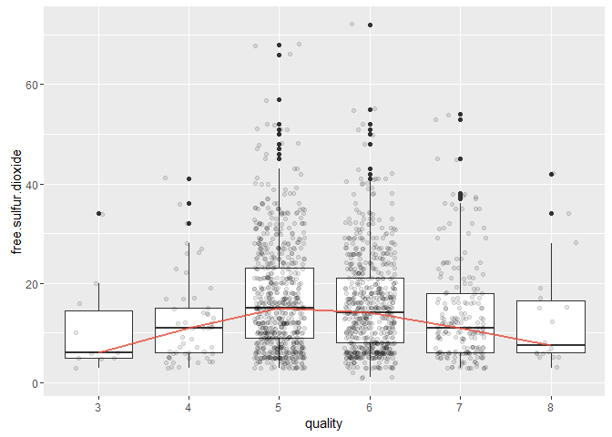<!-- -->

The middle quality classes seem to have higher free sulfur dioxide than both the low and high quality.

According to the dataset description, when free SO2 is lower than 50 ppm (~ 50 mg/L), it is undetectable. We can see in the following plot that very few wines are above this threshold which leads us to think that the variations seen in this plot are not related to an effect of the free SO2, but to the non balanced distribution of wines across the quality classes.

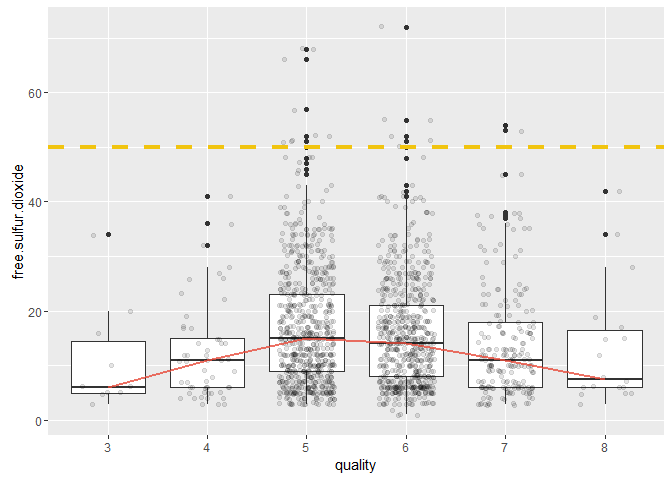<!-- -->


## Total sulfur dioxide  vs. Quality


```
## [1] "Median of total.sulfur.dioxide by quality:"
## wines$quality: 3
## [1] 15
## -------------------------------------------------------- 
## wines$quality: 4
## [1] 26
## -------------------------------------------------------- 
## wines$quality: 5
## [1] 47
## -------------------------------------------------------- 
## wines$quality: 6
## [1] 35
## -------------------------------------------------------- 
## wines$quality: 7
## [1] 27
## -------------------------------------------------------- 
## wines$quality: 8
## [1] 21.5
```

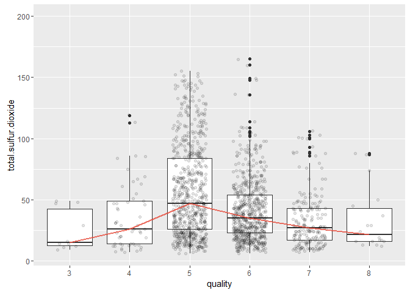<!-- -->

Similar relation as with free sulfur dioxide. The middle classes have higher concentration than both the low and high.

## Density vs. Quality


```
## [1] "Median of density by quality:"
## wines$quality: 3
## [1] 0.997565
## -------------------------------------------------------- 
## wines$quality: 4
## [1] 0.9965
## -------------------------------------------------------- 
## wines$quality: 5
## [1] 0.997
## -------------------------------------------------------- 
## wines$quality: 6
## [1] 0.99656
## -------------------------------------------------------- 
## wines$quality: 7
## [1] 0.99577
## -------------------------------------------------------- 
## wines$quality: 8
## [1] 0.99494
```

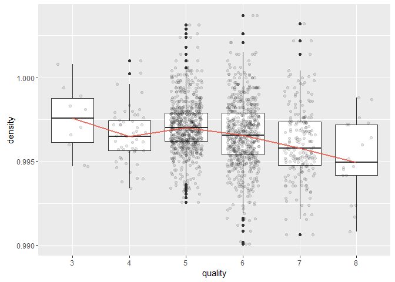<!-- -->

Lower density means higher quality. From the dataset descriptions we know that the density will depend on the percentage of alcohol and sugar content. We should check those relationships later.


## pH vs. Quality


```
## [1] "Median of pH by quality:"
## wines$quality: 3
## [1] 3.39
## -------------------------------------------------------- 
## wines$quality: 4
## [1] 3.37
## -------------------------------------------------------- 
## wines$quality: 5
## [1] 3.3
## -------------------------------------------------------- 
## wines$quality: 6
## [1] 3.32
## -------------------------------------------------------- 
## wines$quality: 7
## [1] 3.28
## -------------------------------------------------------- 
## wines$quality: 8
## [1] 3.23
```

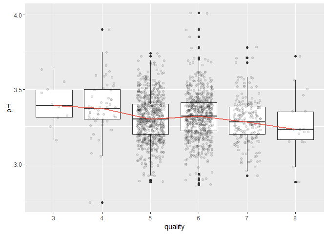<!-- -->

There seems to be a trend of higher quality with lower pH. Higher quality with more acid content? We should check correlations between pH and the acidity levels.

## Sulphates vs. Quality


```
## [1] "Median of sulphates by quality:"
## wines$quality: 3
## [1] 0.545
## -------------------------------------------------------- 
## wines$quality: 4
## [1] 0.56
## -------------------------------------------------------- 
## wines$quality: 5
## [1] 0.58
## -------------------------------------------------------- 
## wines$quality: 6
## [1] 0.64
## -------------------------------------------------------- 
## wines$quality: 7
## [1] 0.74
## -------------------------------------------------------- 
## wines$quality: 8
## [1] 0.74
```

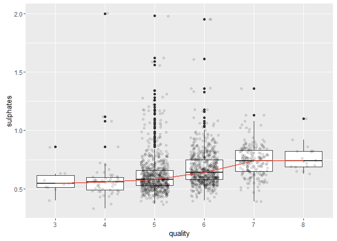<!-- -->

```
## [1] "Median of sulphates by quality:"
## wines$quality: 3
## [1] 0.545
## -------------------------------------------------------- 
## wines$quality: 4
## [1] 0.56
## -------------------------------------------------------- 
## wines$quality: 5
## [1] 0.58
## -------------------------------------------------------- 
## wines$quality: 6
## [1] 0.64
## -------------------------------------------------------- 
## wines$quality: 7
## [1] 0.74
## -------------------------------------------------------- 
## wines$quality: 8
## [1] 0.74
```

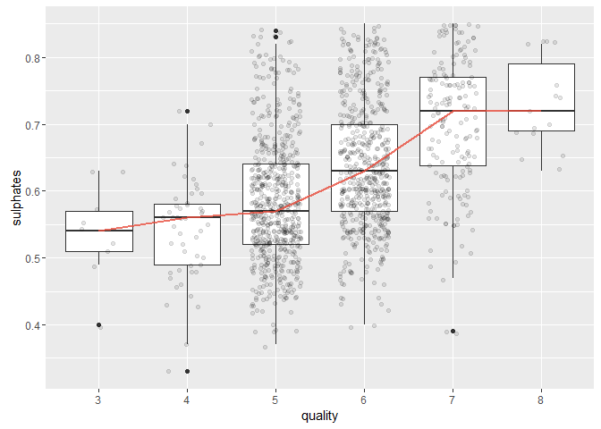<!-- -->

Higher sulphates concentration means higher quality.

## Alcohol vs. Quality


```
## [1] "Median of alcohol by quality:"
## wines$quality: 3
## [1] 9.925
## -------------------------------------------------------- 
## wines$quality: 4
## [1] 10
## -------------------------------------------------------- 
## wines$quality: 5
## [1] 9.7
## -------------------------------------------------------- 
## wines$quality: 6
## [1] 10.5
## -------------------------------------------------------- 
## wines$quality: 7
## [1] 11.5
## -------------------------------------------------------- 
## wines$quality: 8
## [1] 12.15
```

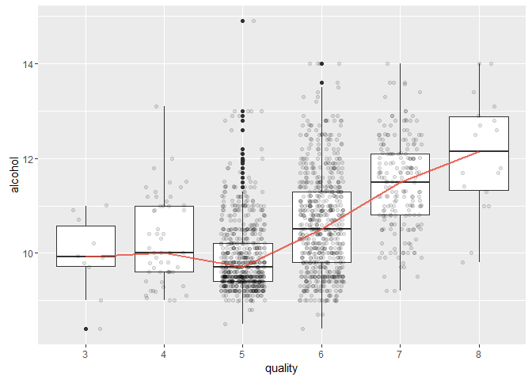<!-- -->

Besides the small downward bump in the quality class 5, the higher the alcohol content, the higher rated the wines get.

## Acidity and pH

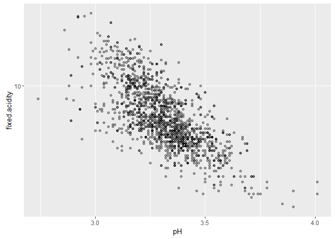<!-- -->

As expected the pH increases with the lower amount of acids. Fixed acidity accounts for most acids present in the wine.

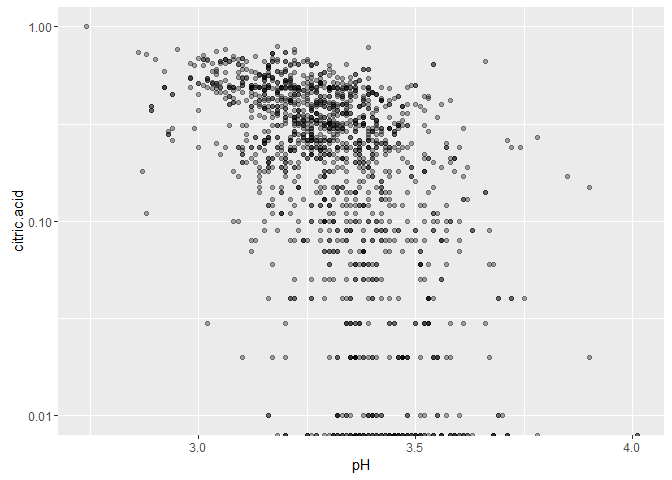<!-- -->

A similar relation is seen with the citric acid variable. But since the citric acid is at lower concentrations, the relation is not so strong. pH will be dominated by the other acids.

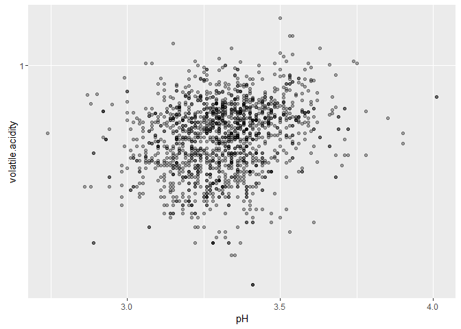<!-- -->

The volatile acidity seems to have either no relation with the pH or a slight positive correlation.

Correlation coefficient:


```
## 
## 	Pearson's product-moment correlation
## 
## data:  pH and log10(volatile.acidity)
## t = 9.1468, df = 1597, p-value < 2.2e-16
## alternative hypothesis: true correlation is not equal to 0
## 95 percent confidence interval:
##  0.1760195 0.2691923
## sample estimates:
##       cor 
## 0.2231154
```

The correlation coefficient shows a weak positive correlation of volatile.acidity with the pH. Maybe when the volatile acids are present in higher concentration, the concentration of the remaining acids is lower and that contributes to the increase of pH.

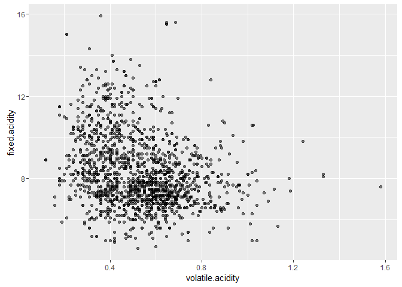<!-- -->

```
## 
## 	Pearson's product-moment correlation
## 
## data:  fixed.acidity and volatile.acidity
## t = -10.589, df = 1597, p-value < 2.2e-16
## alternative hypothesis: true correlation is not equal to 0
## 95 percent confidence interval:
##  -0.3013681 -0.2097433
## sample estimates:
##        cor 
## -0.2561309
```

We can see a weak negative correlation. On the plot, both variables seems to be have a natural limit on the lower sides. We have seen on the univariate plots that both are right skewed.

## Density, Sugar and Alcohol Content

The density of wine should be close to the water density, and will change depending on the percent of alcohol and sugar content.

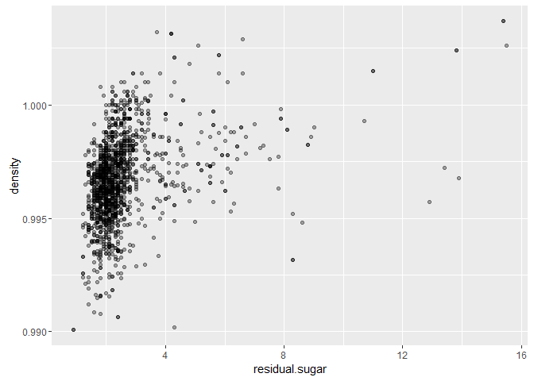<!-- --><!-- -->

We see a increase of density with increase of residual sugar.

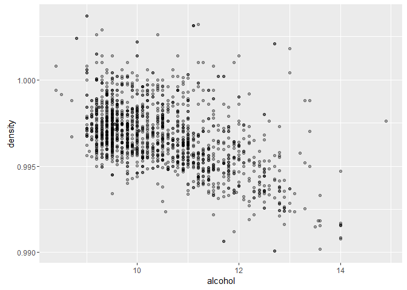<!-- -->

And we see a decrease of density with increase of alcohol content.

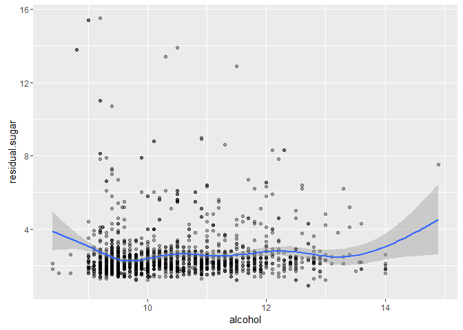<!-- -->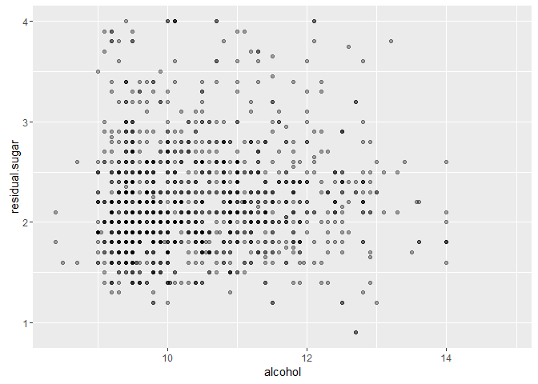<!-- -->

```
## 
## 	Pearson's product-moment correlation
## 
## data:  residual.sugar and alcohol
## t = 1.6829, df = 1597, p-value = 0.09258
## alternative hypothesis: true correlation is not equal to 0
## 95 percent confidence interval:
##  -0.006960058  0.090909069
## sample estimates:
##        cor 
## 0.04207544
```

I was expecting a stronger correlation between the alcohol content and the residual sugar, since the alcohol comes from the fermentation of the sugars.

Maybe some of the wines are fortified with extra alcohol added that does not come from the fermentation of the sugar, or the yeast strains have different metabolic behaviors which do not allow to establish a linear relationship between sugar fermentation and alcohol production. Also, we don't know which grape types were used, which may have different sugar contents.


## Sulphates and sulfur oxide

Sulphate is an additive which can contribute to sulfur dioxide gas levels.

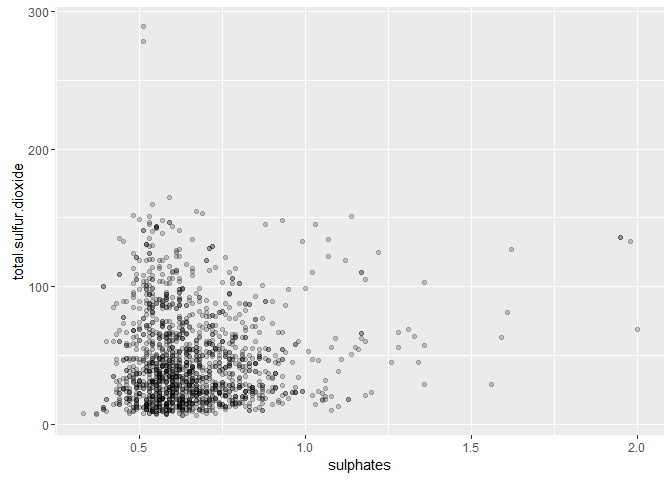<!-- -->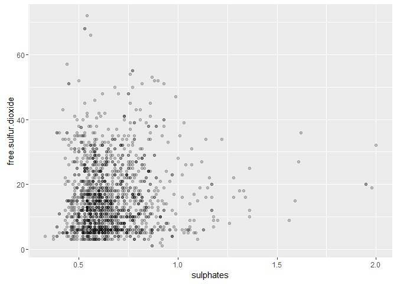<!-- -->

```
## 
## 	Pearson's product-moment correlation
## 
## data:  total.sulfur.dioxide and sulphates
## t = 1.7178, df = 1597, p-value = 0.08602
## alternative hypothesis: true correlation is not equal to 0
## 95 percent confidence interval:
##  -0.006087119  0.091774762
## sample estimates:
##        cor 
## 0.04294684
```

```
## 
## 	Pearson's product-moment correlation
## 
## data:  free.sulfur.dioxide and sulphates
## t = 2.0671, df = 1597, p-value = 0.03888
## alternative hypothesis: true correlation is not equal to 0
## 95 percent confidence interval:
##  0.002643125 0.100424406
## sample estimates:
##        cor 
## 0.05165757
```

The relationship between sulphate levels and sulfur dioxide is very weak.


## Correlations with quality


```
##                             [,1]
## fixed.acidity         0.11408367
## volatile.acidity     -0.38064651
## citric.acid           0.21348091
## residual.sugar        0.03204817
## chlorides            -0.18992234
## free.sulfur.dioxide  -0.05690065
## total.sulfur.dioxide -0.19673508
## density              -0.17707407
## pH                   -0.04367193
## sulphates             0.37706020
## alcohol               0.47853169
```


# Bivariate Analysis

### Talk about some of the relationships you observed in this part of the investigation. How did the feature(s) of interest vary with other features in the dataset?

The wine quality is higher has stronger relationship with the volatile acidity, citric acid, sulphates and alcohol content. The correlation coefficients show us the strength of the relationship with the remaining variables.


```
##                             [,1]
## fixed.acidity         0.11408367
## volatile.acidity     -0.38064651
## citric.acid           0.21348091
## residual.sugar        0.03204817
## chlorides            -0.18992234
## free.sulfur.dioxide  -0.05690065
## total.sulfur.dioxide -0.19673508
## density              -0.17707407
## pH                   -0.04367193
## sulphates             0.37706020
## alcohol               0.47853169
```

For the free and total sulfur dioxide we have seen in the plots that the medium quality levels (5 and 6) have both higher content than the low and higher quality levels. This may hint at some interaction with the other variables.

### Did you observe any interesting relationships between the other features (not the main feature(s) of interest)?

I observed the expected relation between the pH and acidity level.

It was interesting to observe the relation between the density and the alcohol and sugar content.

I was surprised by not finding a stronger relation between the residual sugar and alcohol level, since the alcohol comes from the fermentation of sugars.

### What was the strongest relationship you found?

The correlation coefficients show that the variable with the strongest relationship with quality is the alcohol content.

# Multivariate Plots Section

## Correlation Matrix

As a starting point let us have a look at a correlation matrix:

<!-- -->

## Alcohol, volatile acidity and quality

Quality strongly correlates with alcohol and volatile.acidity. Volatile acidity comes from acetic acid which can give an unpleasant taste to the wine.

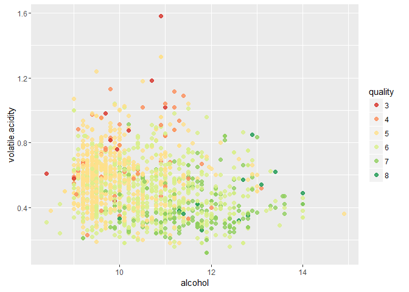<!-- -->

We can see the worse quality wines at low alcohol and high volatile acidity. The middle quality wines (5 and 6) can be found spread around a bit everywhere.

## Acidity, pH, quality

<!-- -->

There seems to be no pattern in the quality distribution here.

## Citric acid, alcohol, quality

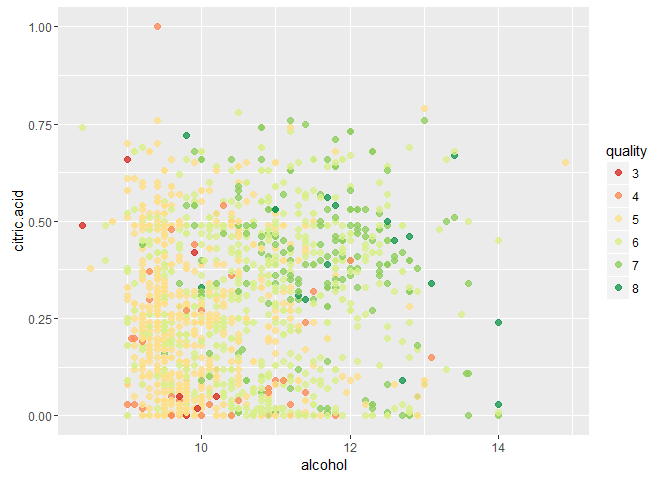<!-- -->

The increase of both citric acid and alcohol tends to give higher quality wines. Nevertheless we see wines with quality 5 on a wide range of citric acid levels at low alcohol content and we see also high quality wines with low citric acid content.


## Alcohol and Sulphates

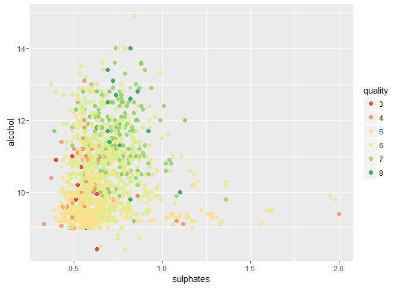<!-- -->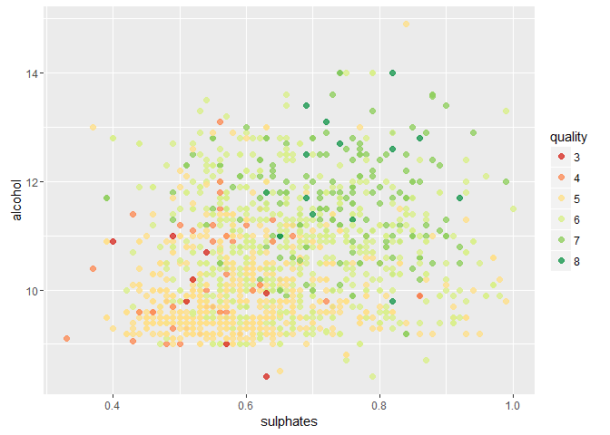<!-- -->

For the range of sulphates between 0 and 1, alcohol and sulphates appear to have a positive correlation and higher alcohol combined with higher sulphates yields higher quality wines.


```
## 
## 	Pearson's product-moment correlation
## 
## data:  alcohol and sulphates
## t = 3.7568, df = 1597, p-value = 0.0001783
## alternative hypothesis: true correlation is not equal to 0
## 95 percent confidence interval:
##  0.04477906 0.14196454
## sample estimates:
##        cor 
## 0.09359475
```


# Multivariate Analysis

### Talk about some of the relationships you observed in this part of the investigation. Were there features that strengthened each other in terms of looking at your feature(s) of interest?

The main relationships explored were between the biggest correlators with quality.

We have seen how alcohol and volatile acidity relate with quality. Higher alcohol and lower acidity give in general better quality wines.

Higher amounts of citric acid combined with higher alcohol content yield the best wines.

Also with sulphates we see the same trend of better quality when both the alcohol and sulphates become higher.

------

# Final Plots and Summary

### Plot One
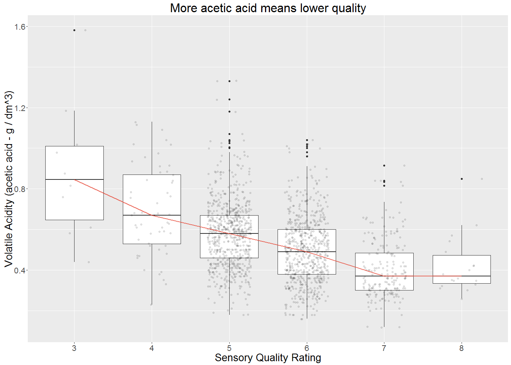<!-- -->

### Description One

We can see the distribution of volatile acidity across the different quality ratings. The boxplot shows the quantile boundaries and median values, while the overlapping dots shows us the actual distribution of wines in the categories. We can see an unbalanced amount between the middle ratings and the extreme ratings. There are much more middle quality wines than there are low and high quality wines. The red line connects the median values and helps us grasp visually the decreasing trend of volatile acidity with quality. Wines with lower volatile acidity content are rated higher in quality.


### Plot Two

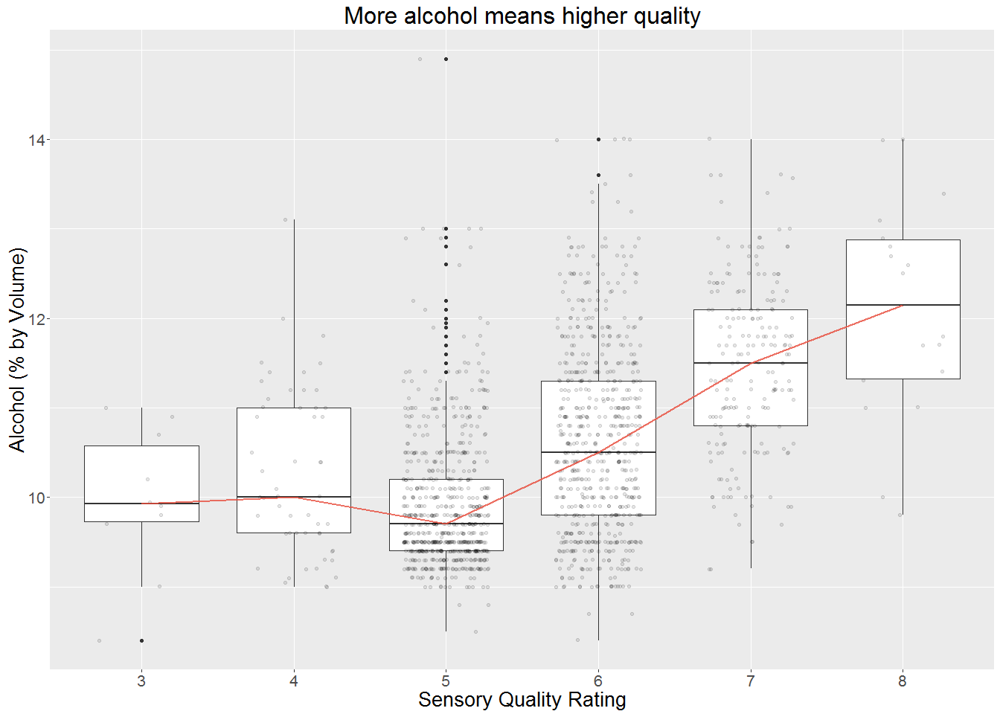<!-- -->

### Description Two

We can see a big impact of alcohol level on the quality of wines. For the quality classes 3 to 5, the effect is limited. The quality is probably being steered by another variable, but from the quality rating 5 to 8, we see a sharp increase in the alcohol content. The general trend is that Wines with higher alcohol content are rated higher in quality.

### Plot Three
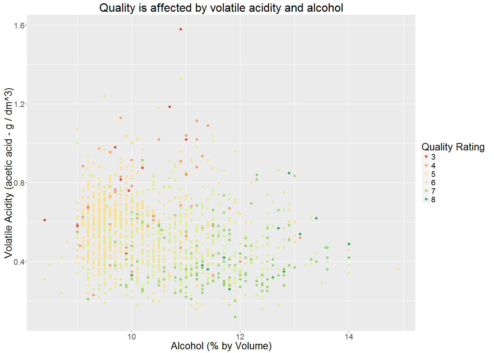<!-- -->

### Description Three

In our exploration we have seen that alcohol and volatile acidity had a big influence on the quality of the wines. On this plot we see the combined effect of this two variables on the quality. The wines with high volatile acidity and low alcohol have lower quality rating. Then we see that at low volatile acidity and low alcohol, the wines tend to be in the middle quality rating categories. At low volatile acidity and high alcohol content we find the higher quality wines.

# Reflection

This project was an interesting opportunity to put all the knowledge of the R plotting functionality to explore a real dataset. The dataset was put together for the purpose of applying machine learning techniques and was therefore already very well organized without any missing data. The only downside was the unbalancing of the classes: much more wines at the middle levels than at the low and high ends.

When working with such a dataset the first challenge is to choose in which direction to steer our exploration. Luckily, the dataset description file already hints at some variables of interest. For example, it tells us that citric acid can add freshness to wines, while acetic acid can add an unpleasant vinegar taste. This shows how important it is to have specific domain knowledge while performing a data analysis. Without it we are left adrift and will spend much time exploring in the wrong directions. When we do not have that domain knowledge, consulting with an expert in the field will be incredibly valuable to save us some time.

Another challenge I faced was interpreting the multivariate plots. When adding a third dimension - in this project, a color was mostly used - it becomes harder to grasp trends. There is no longer a nice line to guide our eyes, but instead the change of color should tell in which directions are our variables evolving. The use of a correlation matrix to find which variables have the biggest correlations helped to trim down the combinations to explore and made it easier to find interesting patterns.

As a follow up exercise, we could think of bringing the white wine dataset into this analysis and explore if the same trends that we found here apply on the different sort of wines.

Finally, having identified the main trends in the data, prediction models could be build to see how good this trends can be used to predict the wine quality based on the physicochemical attributes.


# References

Cortez, P., Cerdeira, A., Almeida, F., Matos, T. and Reis, J. (2009). Modeling wine preferences by data mining from physicochemical properties. _Decision Support Systems_, 47(4), pp.547-553.

Stattrek.com, (2016). _Patterns of Data in Statistics._ [online] Available at: [http://stattrek.com/statistics/charts/data-patterns.aspx?tutorial=ap](http://stattrek.com/statistics/charts/data-patterns.aspx?tutorial=ap) [Accessed 22 Feb. 2016].
